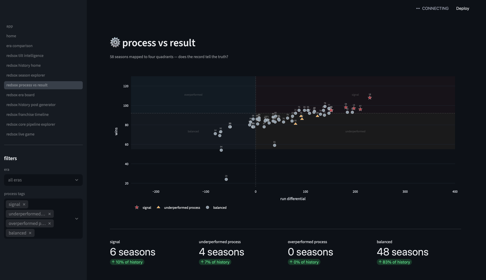

# frame² — Red Sox MVP

frame² is a sports intelligence app.

most sports sites show statistics.

frame² explains why the game changed.

---

## idea

result = process + variance

frame² explains games using:

observation → mechanism → implication

---

## example

fans see: a comeback

frame² sees: the pitcher losing the strike zone

implication: the edge flipped before the scoreboard changed

---

## features

- red sox season explorer
- process vs result analysis
- franchise timeline explorer
- core + prospect pipeline explorer
- live game intelligence
- creator post generator

---

## run locally

cd frame2_redsox_mvp
python3 -m venv venv
source venv/bin/activate
pip install -r requirements.txt
export PYTHONPATH=.
streamlit run app/app.py

open in browser:

http://localhost:8501

## red sox process vs result model

visualizing when performance matches underlying process.

---

## creator

ian kachadorian
creator of frame²
