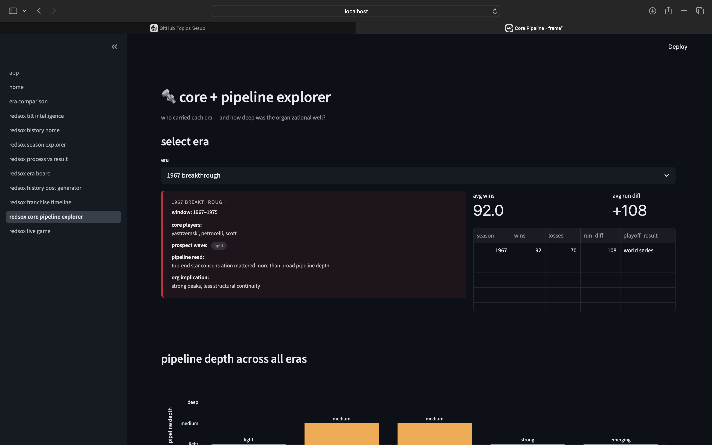
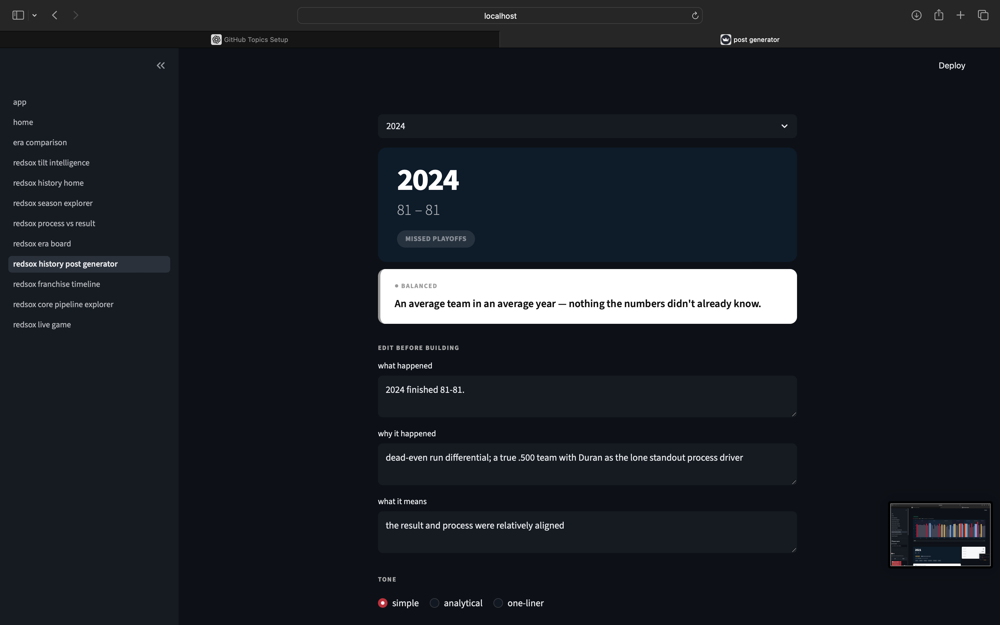

# frame² — red sox MVP

frame² is a sports intelligence app.

most sports sites show statistics.
frame² explains **why the game changed.**

core idea:

result = process + variance

framework:

observation → mechanism → implication

## example

fans see: a red sox season
frame² sees: a red sox season compared to other red sox seasons

## run locally

git clone https://github.com/dualityframework-ux/frame2_redsox_mvp

cd frame2_redsox_mvp

pip install -r requirements.txt

streamlit run app.py

---
## demo

### core + pipeline explorer

---

### franchise timeline

---

### season insight generator

## creator

